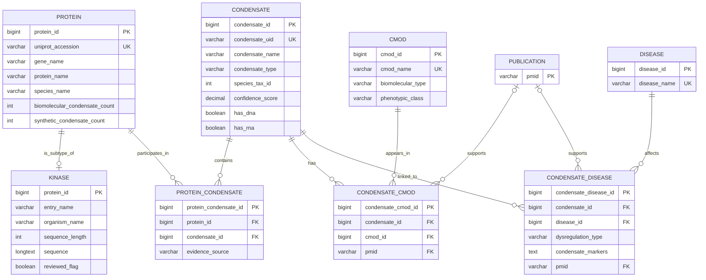

# BF768-Final-

## MVP Implementation (Flask + Relational Integration)

This repository now includes a working MVP that demonstrates:

- Project-specific relational integration over source data files.
- Custom entity model (`protein`, `condensate`, `protein_condensate`, `cmod`, `disease`, evidence tables).
- Three custom query workflows:
  - Kinase -> Condensates
  - Condensate -> Proteins
  - Disease -> Condensates + Evidence
- Custom interface layer via Flask pages (`/`, `/help`, query routes).
- Custom outputs:
  - CSV export for each query
  - Generated PNG graph (`/plot`)

### Run locally

1. Install dependencies:
   - `python -m pip install -r requirements.txt`
2. Build/load the database:
   - `python scripts/load_data.py`
3. Start the web app:
   - `python app.py`
4. Open:
   - `http://127.0.0.1:5000/`

## BF768_Final_Proposal_Workflow_Progress

```
BF768_Final_Proposal_Workflow_Progress/
├── 阶段零：选题与proposal框架确认
│   ├── 1. 明确最终研究主题
│   │   └── 主题确定为：激酶与特定生物分子缩合物（Biomolecular Condensates）的互作图谱
│   ├── 2. 明确proposal撰写原则
│   │   ├── 以当前主题为准
│   │   ├── 以当前目录树为准
│   │   ├── 若与draft内容冲突，则忽略draft中的冲突部分
│   │   └── 忽略draft中潜在的待补充或待修改内容
│   └── 3. 确认目录树是否适配final proposal
│       ├── 对照project proposal guidelines核查结构
│       ├── 确认目录树整体符合final proposal要求
│       └── 确认当前目录树可作为final proposal写作骨架
│
├── 阶段一：UniProt数据源定位与检索策略确定
│   ├── 1. 明确UniProt在项目中的定位
│   │   ├── 将UniProt定义为"激酶主数据层"来源
│   │   ├── 用于获取Protein / Gene / Function / Feature / External Reference骨架数据
│   │   └── 明确UniProt不作为condensate特异关系证据的唯一来源
│   ├── 2. 明确第一轮应获取的数据类型
│   │   ├── Protein基础信息
│   │   ├── Gene基础信息
│   │   ├── 序列信息
│   │   ├── 长度信息
│   │   └── 为后续功能注释、位点、结构域、外部链接打基础
│   └── 3. 确定第一轮检索目标
│       └── 先获取"人类 reviewed kinase 主集合（kinase backbone）"
│
├── 阶段二：UniProt检索式设计与合理性确认
│   ├── 1. 初步检索式提出
│   │   └── (taxonomy_id:9606) AND (keyword:KW-0418) AND (reviewed:true)
│   ├── 2. 检索式合理性评估
│   │   ├── 确认该检索式可用于提取人类reviewed kinase集合
│   │   ├── 确认其适合作为V1激酶主集合入口
│   │   └── 确认其不应被视为整个项目的最终唯一边界
│   ├── 3. 检索式标准化
│   │   └── 规范写法确定为：organism_id:9606 AND reviewed:true AND keyword:KW-0418
│   └── 4. 明确检索后下一步
│       ├── 固定accession/entry主集合
│       ├── 下载第一轮主表字段
│       └── 后续围绕accession开展第二轮注释抓取
│
├── 阶段三：第一轮导出字段设计
│   ├── 1. 确定第一轮导出的目标
│   │   └── 先建立可入库的激酶主表原始数据，而非一次性抓取全部注释
│   ├── 2. 初步推荐字段范围
│   │   ├── Entry / accession
│   │   ├── Entry Name
│   │   ├── Protein names
│   │   ├── Gene Names
│   │   ├── Organism
│   │   ├── Length
│   │   └── Sequence
│   ├── 3. 讨论Reviewed字段的必要性
│   │   ├── 识别到Reviewed在当前query下信息增量较小
│   │   └── 认为其可保留用于人工检查，但不是必须字段
│   └── 4. 明确第一轮不急于导出的字段
│       ├── 功能长文本
│       ├── 位点明细
│       ├── 结构域明细
│       └── 大量外部数据库交叉引用
│
├── 阶段四：网页端导出配置与问题排查
│   ├── 1. 在UniProt网页端设置导出方式
│   │   ├── 选择 Download all
│   │   ├── 选择 Format = TSV
│   │   └── 选择 Compressed = No
│   ├── 2. 尝试在Customize columns中配置字段
│   │   ├── 初始选择过 Reviewed
│   │   ├── 选择了 Entry Name
│   │   ├── 选择了 Protein names
│   │   ├── 选择了 Gene Names
│   │   ├── 选择了 Organism
│   │   ├── 选择了 Length
│   │   └── 选择了 Sequence
│   ├── 3. 遇到"Entry / Accession无法搜索到"的问题
│   │   ├── 搜索 Accession 未命中
│   │   ├── 搜索 entry 仅出现 Entry Name
│   │   └── 判断Customize columns未显式暴露Entry/Accession作为可添加列
│   ├── 4. 通过Preview验证默认列
│   │   ├── 使用 Preview 10 预览导出结果
│   │   ├── 确认第一列自动存在
│   │   └── 确认第一列即为 entry
│   └── 5. 得出网页端导出结论
│       ├── 无需强行在Customize columns里再找Entry/Accession
│       ├── 默认第一列已满足主键需求
│       └── 当前网页端导出配置可继续使用
│
├── 阶段五：第一轮TSV导出完成
│   ├── 1. 执行正式导出
│   │   └── 已将全部检索结果导出为TSV文件
│   ├── 2. 明确当前已获得的数据范围
│   │   ├── 人类
│   │   ├── reviewed
│   │   ├── kinase keyword匹配
│   │   └── 共632条结果
│   └── 3. 确认当前数据集的项目定位
│       ├── 这是项目的"kinase backbone"
│       ├── 这是Protein主表原始数据来源
│       └── 这不是最终的condensate关系证据数据
│
├── 阶段六：导出后数据组织方案确定
│   ├── 1. 明确当前阶段任务重心
│   │   └── 从"继续下载"转向"数据整理与schema对接"
│   ├── 2. 规划第一轮字段重命名
│   │   ├── entry → uniprot_accession
│   │   ├── Entry Name → entry_name
│   │   ├── Protein names → protein_name
│   │   ├── Gene Names → gene_names_raw
│   │   ├── Organism → organism_name
│   │   ├── Length → sequence_length
│   │   └── Sequence → sequence
│   ├── 3. 明确第一轮需要做的数据检查
│   │   ├── 检查uniprot_accession是否唯一
│   │   ├── 检查是否存在空值
│   │   ├── 检查Gene Names是否含多个名称
│   │   ├── 检查Protein names是否包含复杂别名结构
│   │   └── 检查Sequence长度是否与Length一致
│   ├── 4. 初步确定第一版数据库表方向
│   │   ├── Protein表
│   │   ├── Gene表
│   │   └── Protein_Gene关联表
│   └── 5. 明确当前清洗原则
│       ├── 先保留原始字段
│       ├── Gene Names后续拆分
│       ├── Protein names后续规范化
│       └── accession作为后续所有注释抓取和关联的核心键
│
└── 阶段七：下一阶段任务已明确但尚未执行
    ├── 1. 第二轮注释抓取规划
    │   ├── Function层
    │   │   ├── function
    │   │   ├── catalytic activity
    │   │   └── GO terms
    │   ├── Feature层
    │   │   ├── domain
    │   │   ├── binding site
    │   │   ├── active site
    │   │   └── 其他site/region/motif/PTM
    │   ├── Interaction层
    │   │   ├── subunit / complex
    │   │   ├── general interaction
    │   │   └── external PPI references
    │   └── ExternalReference层
    │       ├── IntAct
    │       ├── Complex Portal
    │       ├── InterPro
    │       ├── Pfam
    │       └── PDB
    ├── 2. 明确第二轮抓取原则
    │   ├── 不再按keyword大范围盲抓
    │   ├── 围绕第一轮得到的entry/accession集合开展
    │   └── 以accession为外键建立注释层
    └── 3. 明确后续与主题的衔接方向
        ├── 当前完成的是kinase主数据层
        ├── 下一步完成的是kinase annotation layer
        └── 再下一步才是condensate-specific relation layer
```

Below is the complete formal English version for **Items 9 through 16** of the final proposal, compiled from all content established in this session and structured as a continuous, submission-ready document. [learn.bu](https://learn.bu.edu/ultra/courses/_275314_1/outline/edit/document/_17606126_1?courseId=_275314_1&view=content&state=view)

***

## Item 9: Task List

### List of Tasks to Be Accomplished

The following tasks are expected to be completed over the course of this project. They are organized in the order in which they will be carried out.

1. **Topic definition and scope confirmation.** Define the research question as the construction of a relational database for mapping human kinase interactions with specific biomolecular condensates, using publicly available condensate and kinase annotation data.

2. **Data source identification and acquisition.** Identify and obtain all input data files, including the reviewed human kinase set from UniProt, the condensate master table from the condensate annotation database, protein-condensate association mappings, c-mod records, condensatopathy records, and publication identifiers.

3. **Data cleaning and normalization.** Standardize field names, resolve multi-value fields such as comma-separated protein lists into relational rows, validate UniProt accession uniqueness, verify sequence length consistency, and handle missing values in key fields.

4. **Database schema design.** Finalize the entity-relationship model, define all table structures with primary keys, foreign keys, and indexed fields, and confirm that the schema supports all planned query functions.

5. **Database implementation in MariaDB.** Create all tables according to the finalized schema, apply all defined constraints and indexes, and load cleaned data into the database from processed source files.

6. **SQL query development.** Implement at least three sample SQL queries representing common user functions, test query correctness, and verify that all queries make use of the intended indexes.

7. **Web interface development in Flask.** Implement an HTML/JavaScript-based query interface with at least one search page per query type, one results page, and one help page. The interface must support user input, query execution, and display of results.

8. **AJAX implementation.** Implement at least one AJAX-based dynamic interface behavior so that partial page updates occur without full page reloads.

9. **Graphical output implementation.** Implement at least one view in which a graphical file is generated and saved by the Flask application and displayed on a results page.

10. **Data download implementation.** Implement a download function so that users can export the currently displayed query result set as a CSV file from the results page.

11. **External database link integration.** Add hyperlinks to UniProt and PubMed in result pages, using stored UniProt accessions and PMIDs.

12. **Testing and validation.** Test all query pages, results pages, help pages, download links, external links, AJAX behaviors, and graphical output across the main use cases.

13. **Help page and documentation.** Write a help page describing how to use the database, how to interpret results, and what external resources are linked.

14. **Final integration and submission.** Review all components for internal consistency, complete any remaining requirements, and submit the final proposal and project.

***

## Item 10: Entity-Relationship Model

### E-R Model Including Key and Participation Constraints

The database centers on nine entities and eight relationships. Key constraints and participation constraints are listed for each relationship below.

**Entities and primary keys:**
- `Protein`: primary key `protein_id`; unique key `uniprot_accession`
- `Kinase`: primary key `protein_id` (also foreign key to `Protein`)
- `Condensate`: primary key `condensate_id`; unique key `condensate_uid`
- `Protein_Condensate`: primary key `protein_condensate_id`; unique on `(protein_id, condensate_id)`
- `CMod`: primary key `cmod_id`; unique key `cmod_name`
- `Condensate_CMod`: primary key `condensate_cmod_id`
- `Disease`: primary key `disease_id`; unique key `disease_name`
- `Condensate_Disease`: primary key `condensate_disease_id`
- `Publication`: primary key `pmid`

**Relationships and participation constraints:**

| Relationship | Cardinality | Participation constraints |
|---|---|---|
| `Protein` — `Kinase` | 1 : 0..1 | `Kinase` total; `Protein` partial |
| `Protein` — `Protein_Condensate` | 1 : 0..N | `Protein_Condensate` total; `Protein` partial |
| `Condensate` — `Protein_Condensate` | 1 : 0..N | `Protein_Condensate` total; `Condensate` partial |
| `Condensate` — `Condensate_CMod` | 1 : 0..N | `Condensate_CMod` total; `Condensate` partial |
| `CMod` — `Condensate_CMod` | 1 : 0..N | `Condensate_CMod` total; `CMod` partial |
| `Condensate` — `Condensate_Disease` | 1 : 0..N | `Condensate_Disease` total; `Condensate` partial |
| `Disease` — `Condensate_Disease` | 1 : 0..N | `Condensate_Disease` total; `Disease` partial |
| `Publication` — `Condensate_CMod` | 1 : 0..N | both sides partial |
| `Publication` — `Condensate_Disease` | 1 : 0..N | both sides partial |

**E-R diagram:**



***

## Item 11: Description of Tables

### Table Descriptions Including Keys, Foreign Keys, and Indexed Fields

**Table: `Protein`**  
Stores the base record for every protein in the database. This table serves as the central entity from which kinase-specific information and condensate associations are extended.
- Primary key: `protein_id`
- Unique key: `uniprot_accession`
- Foreign keys: none
- Indexed fields: `PRIMARY KEY (protein_id)`; `UNIQUE BTREE (uniprot_accession)`; `BTREE (gene_name)`; `BTREE (species_name)`

**Table: `Kinase`**  
Stores human reviewed kinase-specific fields as a subtype of `Protein`. Every row in this table must correspond to an existing row in `Protein`.
- Primary key: `protein_id`
- Foreign keys: `protein_id → Protein.protein_id`
- Indexed fields: `PRIMARY KEY (protein_id)`; `BTREE (entry_name)`; `BTREE (reviewed_flag)`

**Table: `Condensate`**  
Stores the master record for each biomolecular condensate, including type classification, species, and confidence score.
- Primary key: `condensate_id`
- Unique key: `condensate_uid`
- Foreign keys: none
- Indexed fields: `PRIMARY KEY (condensate_id)`; `UNIQUE BTREE (condensate_uid)`; `BTREE (condensate_name)`; `BTREE (condensate_type)`; `BTREE (species_tax_id)`

**Table: `Protein_Condensate`**  
Stores the many-to-many association between proteins and condensates. Each row records one protein-condensate pair.
- Primary key: `protein_condensate_id`
- Foreign keys: `protein_id → Protein.protein_id`; `condensate_id → Condensate.condensate_id`
- Indexed fields: `PRIMARY KEY (protein_condensate_id)`; `UNIQUE BTREE (protein_id, condensate_id)`; `BTREE (condensate_id)`; `BTREE (protein_id)`

**Table: `CMod`**  
Stores records for condensate-related biological molecules or modifications.
- Primary key: `cmod_id`
- Unique key: `cmod_name`
- Foreign keys: none
- Indexed fields: `PRIMARY KEY (cmod_id)`; `UNIQUE BTREE (cmod_name)`; `BTREE (biomolecular_type)`; `BTREE (phenotypic_class)`

**Table: `Condensate_CMod`**  
Stores the many-to-many association between condensates and c-mods, with optional literature support.
- Primary key: `condensate_cmod_id`
- Foreign keys: `condensate_id → Condensate.condensate_id`; `cmod_id → CMod.cmod_id`; `pmid → Publication.pmid`
- Indexed fields: `PRIMARY KEY (condensate_cmod_id)`; `UNIQUE BTREE (condensate_id, cmod_id, pmid)`; `BTREE (cmod_id)`; `BTREE (pmid)`

**Table: `Disease`**  
Stores the master record for each condensatopathy or disease associated with condensate dysfunction.
- Primary key: `disease_id`
- Unique key: `disease_name`
- Foreign keys: none
- Indexed fields: `PRIMARY KEY (disease_id)`; `UNIQUE BTREE (disease_name)`

**Table: `Condensate_Disease`**  
Stores the many-to-many association between condensates and diseases, including dysregulation type, condensate markers, and supporting PMID.
- Primary key: `condensate_disease_id`
- Foreign keys: `condensate_id → Condensate.condensate_id`; `disease_id → Disease.disease_id`; `pmid → Publication.pmid`
- Indexed fields: `PRIMARY KEY (condensate_disease_id)`; `BTREE (condensate_id, disease_id)`; `BTREE (disease_id)`; `BTREE (dysregulation_type)`; `BTREE (pmid)`

**Table: `Publication`**  
Stores PubMed identifiers as evidence anchors for association records. All evidence-linked rows in `Condensate_CMod` and `Condensate_Disease` reference this table.
- Primary key: `pmid`
- Foreign keys: none
- Indexed fields: `PRIMARY KEY (pmid)`

***

## Item 12: Sample SQL Queries

### Three Sample SQL Queries for Common Functions of the Database

**Query 1: Retrieve biomolecular condensates associated with a queried human kinase**

*Function.* Given a UniProt accession as input, this query returns the biomolecular condensates associated with the corresponding human kinase. This is the primary kinase-centered lookup function of the database.  
*Tables used:* `Protein`, `Kinase`, `Protein_Condensate`, `Condensate`  
*Indexes used:* `UNIQUE BTREE (Protein.uniprot_accession)` for input predicate; `BTREE (Protein_Condensate.protein_id)` for join; primary keys on `Kinase` and `Condensate`

```sql
SELECT
    p.uniprot_accession,
    p.gene_name,
    p.protein_name,
    c.condensate_uid,
    c.condensate_name,
    c.condensate_type,
    c.confidence_score
FROM Protein AS p
INNER JOIN Kinase AS k
    ON k.protein_id = p.protein_id
INNER JOIN Protein_Condensate AS pc
    ON pc.protein_id = p.protein_id
INNER JOIN Condensate AS c
    ON c.condensate_id = pc.condensate_id
WHERE p.uniprot_accession = :uniprot_accession
ORDER BY c.confidence_score DESC, c.condensate_name ASC;
```

***

**Query 2: Retrieve human kinases associated with a queried biomolecular condensate**

*Function.* Given a condensate UID as input, this query returns the human kinases associated with that condensate. This is the primary condensate-centered browsing function of the database.  
*Tables used:* `Condensate`, `Protein_Condensate`, `Protein`, `Kinase`  
*Indexes used:* `UNIQUE BTREE (Condensate.condensate_uid)` for input predicate; `BTREE (Protein_Condensate.condensate_id)` for join; primary keys on `Protein` and `Kinase`

```sql
SELECT
    c.condensate_uid,
    c.condensate_name,
    p.uniprot_accession,
    p.gene_name,
    p.protein_name,
    k.entry_name,
    k.sequence_length
FROM Condensate AS c
INNER JOIN Protein_Condensate AS pc
    ON pc.condensate_id = c.condensate_id
INNER JOIN Protein AS p
    ON p.protein_id = pc.protein_id
INNER JOIN Kinase AS k
    ON k.protein_id = p.protein_id
WHERE c.condensate_uid = :condensate_uid
ORDER BY p.gene_name ASC, p.uniprot_accession ASC;
```

***

**Query 3: Retrieve disease-associated condensates and supporting evidence for a queried disease**

*Function.* Given a disease name as input, this query returns the condensates linked to that disease, along with dysregulation type, condensate markers, and supporting PMIDs. This is the primary disease- and evidence-centered retrieval function of the database.  
*Tables used:* `Disease`, `Condensate_Disease`, `Condensate`, `Publication`  
*Indexes used:* `UNIQUE BTREE (Disease.disease_name)` for input predicate; `BTREE (Condensate_Disease.disease_id)` for join; `BTREE (Condensate_Disease.pmid)` for publication join

```sql
SELECT
    d.disease_name,
    c.condensate_uid,
    c.condensate_name,
    cd.dysregulation_type,
    cd.condensate_markers,
    pub.pmid
FROM Disease AS d
INNER JOIN Condensate_Disease AS cd
    ON cd.disease_id = d.disease_id
INNER JOIN Condensate AS c
    ON c.condensate_id = cd.condensate_id
LEFT JOIN Publication AS pub
    ON pub.pmid = cd.pmid
WHERE d.disease_name = :disease_name
ORDER BY c.condensate_name ASC, pub.pmid ASC;
```

***

## Item 13: External Data Processing

### External Data Processing

The database itself will perform relational storage, indexed retrieval, table joins, and SQL-based querying in MariaDB. External data processing will be limited to operations carried out by the web application layer rather than by the database engine itself.

User input normalization will be performed in the Flask-based interface before SQL queries are submitted to MariaDB. This processing will include trimming user input, validating expected field formats, and mapping interface selections to database query parameters.

Result pagination and interface-level formatting will be handled outside the database by the web application. These steps are intended to improve the usability of query output pages without altering the underlying stored data.

Aggregation of SQL query output into summary tables for visualization will be performed in Python. These summarized result sets will then be used to generate graphical output files for display on selected results pages.

Graphic generation will be carried out in Flask/Python, and at least one graphical view will be produced as a file saved by the application and displayed to the user. This external processing supports the requirement that at least one database view use a graphics display based on a file produced and saved by the Flask program.

Export of query results into downloadable CSV and optionally TSV files will also be handled by the web interface outside the database engine. The exported files will contain the result set currently displayed to the user, formatted for downstream inspection or reuse.

Construction of outbound links to external resources such as UniProt entries and PubMed records will be performed by the application layer using stored identifiers such as UniProt accessions and PMIDs. This design keeps link generation separate from core relational storage while still supporting the requirement that the database provide links to other databases.

No specialized external analytical pipeline such as BLAST is currently planned; external processing is limited to interface-driven formatting, aggregation, visualization, and file export.

***

## Item 14: External Database Links

### External Database Links

The database will provide direct outbound links to external biological databases and literature resources from its result pages. These links will allow users to move from internally stored records to authoritative source entries for protein annotation and literature evidence.

For protein and kinase records, the database will provide links to **UniProt** using the stored `uniprot_accession` field. These links will be displayed on protein-centered and kinase-centered result pages so that users can access curated protein names, sequence annotations, and related biological information.

For evidence-supported condensate or disease association records, the database will provide links to **PubMed** using the stored `pmid` field. These links will appear on evidence-oriented output pages, allowing users to inspect the original supporting literature for disease associations and condensate-related findings.

If additional annotation identifiers are incorporated during later implementation, the database may also provide links to **PDB**, **Pfam**, **InterPro**, **IntAct**, and **Complex Portal**. These external links will be generated only when corresponding identifiers are available in the stored annotation layer, so that each outbound link is directly supported by a field in the database.

In the current proposal design, the required external links are centered on **UniProt** for protein and kinase records and **PubMed** for literature-supported evidence records. This strategy is sufficient for the proposal stage because it supports both biological entity lookup and evidence traceability while remaining consistent with the planned schema and query functions.

***

## Item 15: Graphical Output

### Graphical Output

The database will provide graphical output to help users interpret query results more efficiently than by reading tables alone. In addition to tabular result pages, selected query outputs will be summarized visually through figures generated by the Flask/Python application and displayed on the results page.

At least one graphical output will be created as a file produced and saved by the Flask program, in accordance with the project requirement for graphical data display. The graphical views will be derived from SQL query results returned by MariaDB and then converted into summary plots by the application layer before being presented to the user.

**Example 1: Bar chart of biomolecular condensate counts for queried kinases.** The x-axis will represent kinase identifiers such as gene names or UniProt accessions, and the y-axis will represent the number of biomolecular condensates associated with each kinase. This figure will allow users to compare the relative breadth of condensate associations among selected kinases. The input will be drawn from the result set of Sample SQL Query 1.

**Example 2: Bar chart of kinase counts associated with a queried condensate.** The queried condensate will serve as the reference entity, and the plot will display the number of kinases associated with that condensate. This figure will provide a compact visual summary of the kinase composition of a condensate-centered result set. The input will be drawn from the result set of Sample SQL Query 2.

**Example 3: Disease-oriented summary plot of condensate associations.** For disease- or dysregulation-based queries, the database will generate a figure showing the number of condensates linked to each disease or grouped by dysregulation type. This graphical output will help users identify which disease categories are most strongly represented in the stored evidence. The input will be drawn from the result set of Sample SQL Query 3.

All graphical outputs will be generated from processed query results, aggregated in Python, saved as PNG files by the application, and displayed on the relevant results page. These graphical views are intended to complement the underlying tabular outputs rather than replace them.

***

## Item 16: Data Download Function

### Data Download Function

The database will include a data download function that allows users to save query results generated through the web interface. Users will download processed result sets returned by the database in response to specific searches, rather than raw source files used during database construction.

The primary downloadable output will consist of tabular query results derived from the main database functions. These downloadable result sets will include kinase-to-condensate search results from Sample SQL Query 1, condensate-to-kinase search results from Sample SQL Query 2, and disease- and evidence-centered query results from Sample SQL Query 3.

For kinase-centered searches, downloadable files will include fields such as UniProt accession, gene name, protein name, condensate UID, condensate name, condensate type, and confidence score. For condensate-centered searches, downloadable files will include condensate UID, condensate name, UniProt accession, gene name, protein name, kinase entry name, and sequence length. For disease and evidence searches, downloadable files will include disease name, condensate UID, condensate name, dysregulation type, condensate markers, and PMID.

The primary download format will be **CSV**, since it is widely supported for tabular biological data and can be opened directly in spreadsheet software or imported into downstream analysis tools. An optional **TSV** format may also be provided. In addition, selected graphical output files generated by the application may be made available for download in **PNG** format.

The download function will be implemented through the web interface and will export the currently displayed result set rather than the entire database. The downloaded file will therefore correspond directly to the query the user has performed and reviewed on screen. This design satisfies the final proposal requirement for a data download function and is aligned with the course expectation that the system support data download into one or more file formats. 
